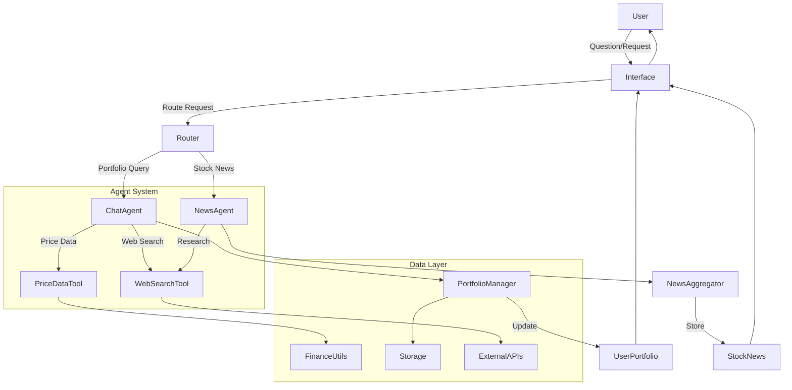

# Trading Agent Platform

A comprehensive multi-agent system that provides trading analysis, portfolio management, and real-time financial information using LangGraph, LangChain, and large language models.

## Overview

The Trading Agent Platform is a sophisticated system that combines conversational AI, financial data processing, and portfolio management capabilities. It uses a multi-agent architecture powered by LangGraph to orchestrate workflows that retrieve up-to-date market information, analyze stock news, manage user portfolios, and respond to user queries through natural language conversations.

The system offers two primary interfaces:
- Command-line interface for quick interactions
- Streamlit web application for comprehensive portfolio management and visualization

## Features

### Core Capabilities
- **Multi-agent Architecture**: Leverages LangGraph for orchestrating specialized agents
- **Real-time Financial Data**: Retrieves current stock prices and historical data
- **Stock News Analysis**: Gathers and summarizes news related to specific stocks
- **Web Search Integration**: Searches the internet for relevant trading information
- **Portfolio Management**: Tracks stock holdings, values, and returns
- **Data Visualization**: Presents portfolio data with interactive charts
- **User Profiles**: Maintains user accounts with personalized portfolios
- **Conversational Interface**: Natural language interaction with the trading agent

### Agent Types
- **Chat Agent**: Handles conversational interactions and answers user queries
- **News Agent**: Researches stock-specific news and provides summaries
- **Tool Node**: Executes specialized tools like web search and price retrieval

## System Architecture



## Components

### Core Agents

- **Chat Agent (`agents/chat_agent.py`)**: 
  - Handles user queries about portfolios and trading
  - Uses LangGraph for conversational workflow
  - Integrates with web search and financial data tools

- **News Agent (`agents/news_agent.py`)**: 
  - Researches and summarizes news for specific stocks
  - Follows a structured workflow for information gathering
  - Provides concise stock-related news summaries

### Tools and Utilities

- **Financial Utilities (`app/utils/finance.py`)**: 
  - Retrieves stock price data
  - Calculates portfolio values and returns

- **News Utilities (`app/utils/news.py`)**: 
  - Fetches and processes stock-related news
  - Maintains news history for stocks in portfolios

- **Storage Utilities (`app/utils/storage.py`)**: 
  - Manages user profiles and portfolio data
  - Handles concurrent file access with locking mechanisms

- **Agent Tools (`agents/tools.py`)**: 
  - Web search functionality using DuckDuckGo
  - Stock price retrieval tools
  - Decision-making tools for agents

### User Interfaces

- **Command Line Interface (`main.py`)**:
  - Simple text-based interaction
  - Quick access to agent responses

- **Streamlit Web Application (`ui_app.py`)**:
  - Rich interactive interface
  - Portfolio dashboard with visualizations
  - Stock news integration
  - Chat interface with the trading agent

## Installation

### Prerequisites

- Python 3.8+
- Required API keys:
  - OpenAI API key (for GPT-4 models)
  - Alternative LLM API keys as needed (Claude, Gemini, etc.)

### Setup Instructions

1. **Clone the repository**:
   ```bash
   git clone https://github.com/bemali/trading-agent.git
   cd trading-agent
   ```

2. **Install dependencies**:
   ```bash
   pip install -r requirements.txt
   ```

3. **Configure environment variables**:
   
   Create a `.env` file in the project root directory with your API keys:
   ```
   OPENAI_API_KEY=your_openai_api_key
   ANTHROPIC_API_KEY=your_anthropic_api_key  # Optional
   GOOGLE_API_KEY=your_google_api_key  # Optional
   LLM_MODEL=gpt-4.1  # Default model
   ```

## Usage

### Command Line Interface

Run the CLI application for quick interactions:

```bash
python main.py
```

The CLI will prompt you for your question and provide a response using the chat agent.

### Web Application

Launch the Streamlit web application for full functionality:

```bash
streamlit run ui_app.py
```

The web application provides:

1. **User Authentication**:
   - Create or log into user accounts
   - No password required (for demonstration purposes)

2. **Portfolio Management**:
   - View portfolio holdings and performance
   - Track stock values and returns
   - Visualize portfolio with interactive charts

3. **Stock News**:
   - See latest news for stocks in your portfolio
   - Summaries of key developments

4. **Chat Interface**:
   - Ask questions about your portfolio
   - Get trading information and insights
   - Receive real-time data through integrated tools

## Project Structure

```
trading-agent/
├── main.py                     # CLI entry point
├── ui_app.py                   # Streamlit web app
├── requirements.txt            # Project dependencies
├── .env                        # Environment variables (create this)
├── agents/                     # Agent definitions
│   ├── chat_agent.py           # Conversational agent
│   ├── news_agent.py           # Stock news research agent
│   ├── custom_tool_node.py     # Tool execution node
│   ├── llms.py                 # LLM configuration
│   ├── state.py                # Agent state definitions
│   ├── tools.py                # Agent tools (web search, etc.)
│   └── instructions/           # Agent system prompts
│       ├── chat_instructions.md
│       └── news_agent_instructions.md
├── app/                        # Application components
│   ├── src/
│   │   └── portfolio_updater.py # Portfolio updating logic
│   └── utils/                  # Utility modules
│       ├── agent_adapter.py    # Integration between UI and agents
│       ├── finance.py          # Financial data functions
│       ├── news.py             # News retrieval functions
│       └── storage.py          # User data storage
├── data/                       # User data storage
│   └── users/                  # User-specific data
│       └── {username}/         # Individual user directories
│           ├── portfolio.json  # User portfolio data
│           ├── profile.json    # User profile information
│           └── stock_news.json # Stock news history
├── tests/                      # Test suite
│   ├── test_finance.py
│   ├── test_news.py
│   ├── test_portfolio_updater.py
│   └── test_storage.py
└── visualizations/             # Documentation diagrams
    └── system_architecture.md  # System architecture documentation
```

## Development

### Adding New Features

The modular design allows for easy extension:

1. **New Agents**: Create new agent modules in the `agents/` directory
2. **New Tools**: Add tools to `agents/tools.py`
3. **UI Enhancements**: Extend the Streamlit interface in `ui_app.py`

### Testing

Run the test suite to verify functionality:

```bash
pytest tests/
```

## Dependencies

Key libraries used in this project:

- **LangChain & LangGraph**: Agent orchestration and workflows
- **Streamlit**: Web interface
- **BeautifulSoup & DDGS**: Web scraping and search
- **Pandas & Altair**: Data processing and visualization
- **Matplotlib**: Charting and visualization

## License

[MIT License](LICENSE)

## Contributors

- [bemali](https://github.com/bemali)

## Acknowledgments

This project demonstrates the application of large language models and agent frameworks in the financial domain, showcasing how AI can assist with trading decisions and portfolio management.
