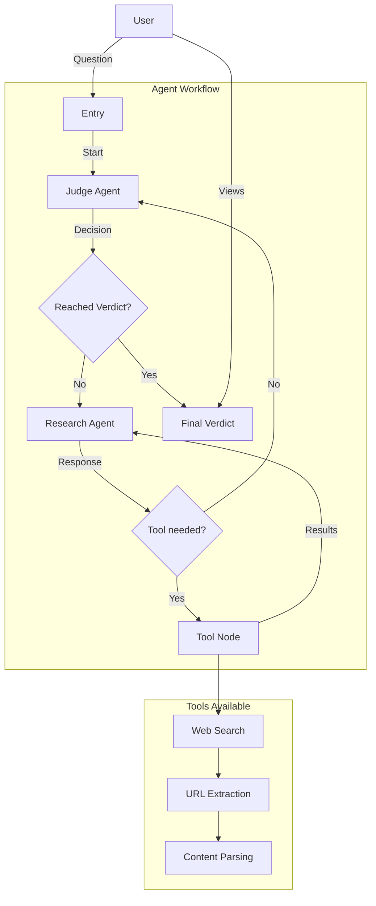

# Trading Agent

A multi-agent system that retrieves information relevant for trading decisions using LangGraph, LangChain, and large language models.

## Overview

This project implements a conversational agent system that processes user questions through a debate-like workflow, retrieves up-to-date information, and provides comprehensive analyses. Despite the repo name "trading-agent", the current implementation functions as a general research and information analysis system that could be applied to trading scenarios.

The system utilizes a workflow with multiple specialized agents:

- **Judge Agent**: Evaluates questions, provides research instructions, and delivers final verdicts
- **Research Agent**: Searches the web for relevant information based on the judge's instructions
- **Tool Node**: Executes tools like web search to gather information

## Features

- Multi-agent architecture using LangGraph for orchestration
- Web search capability to retrieve up-to-date information
- User history tracking for contextual awareness
- Support for multiple LLM models (GPT-4, Claude-3-Opus, Gemini Pro, Mistral Large)
- Available as both CLI application and Streamlit web interface
- Maintains user profiles and conversation history

## Architecture



## Getting Started

### Prerequisites

- Python 3.8+
- OpenAI API key or other LLM API keys
- Required Python packages listed in `requirements.txt`

### Installation

1. Clone the repository:
   ```
   git clone https://github.com/bemali/trading-agent.git
   cd trading-agent
   ```

2. Install dependencies:
   ```
   pip install -r requirements.txt
   ```

3. Create a `.env` file with your API keys:
   ```
   OPENAI_API_KEY=your_api_key_here
   ```

### Usage

#### Command Line Interface

Run the application using the main script:

```
python main.py
```

You will be prompted to:
1. Enter your name (or remain anonymous)
2. Select an LLM model
3. Enter your question

#### Streamlit Web Interface

Run the Streamlit application:

```
streamlit run app.py
```

This opens a web interface where you can:
1. Configure the model and API key
2. Ask questions
3. View the debate process
4. Review your history of previous debates

## Project Structure

- `main.py` - CLI entry point
- `app.py` - Streamlit web application
- `requirements.txt` - Project dependencies
- `user_profiles.json` - Stored user history
- `src/` - Core functionality
  - `simple_graph.py` - LangGraph workflow definition
  - `tools.py` - Tool implementations (web search)
  - `state.py` - State definitions
  - `llms.py` - LLM configurations
  - `tracking_tool_node.py` - Custom tool execution tracking
  - `instructions/` - System prompts for agents

## License

[Add license information]

## Contributors

[Add contributor information]
