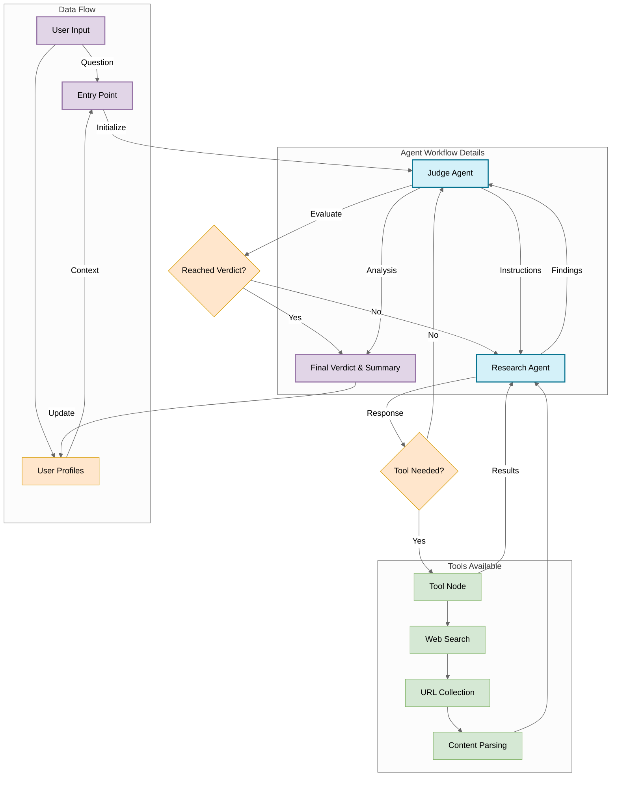

# Trading Agent System Architecture

This diagram illustrates the architecture and workflow of the Trading Agent system.

## Component Descriptions

### Agents
- **Judge Agent**: Orchestrates the workflow, evaluates research, and provides final verdicts
- **Research Agent**: Performs web searches and information gathering based on judge instructions

### Tools
- **Web Search**: Searches the web using DuckDuckGo search API
- **URL Collection**: Gathers relevant URLs from search results
- **Content Parsing**: Extracts and processes text content from web pages

### Data Flow
- User questions are evaluated by the Judge Agent
- Research Agent gathers information using tools when needed
- Judge Agent makes the final decision when sufficient information is available
- User profiles store conversation history for context in future interactions
